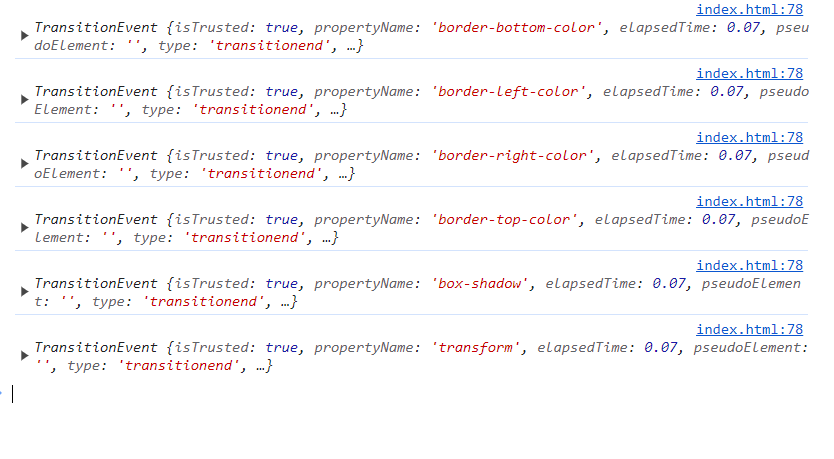

# Javascript의 transitioned 이벤트

## transitioned 이벤트란?

CSS transition이 완료된 직후에 발생하는 이벤트

## 주의할 부분

1. transition 속성이 제거되거나 display가 none으로 설정된 경우와 같이, transition이 완료되기 전에 제거된 경우에는 이벤트가 발생하지 않음
2. 만약 transition 속성을 all로 지정하면, 여러 속성에 대해 transitioned 이벤트가 동시에 발생할 수 있으므로, `e.propertyName` 을 확인해서 특정 transition이 완료된 후에만 이벤트가 발생하도록 해야함



```js
const removeTransition = (e) => {
  if (e.propertyName !== 'transform') return;
  e.target.classList.remove('playing');
};

key.addEventListener('transitionend', removeTransition);
```
